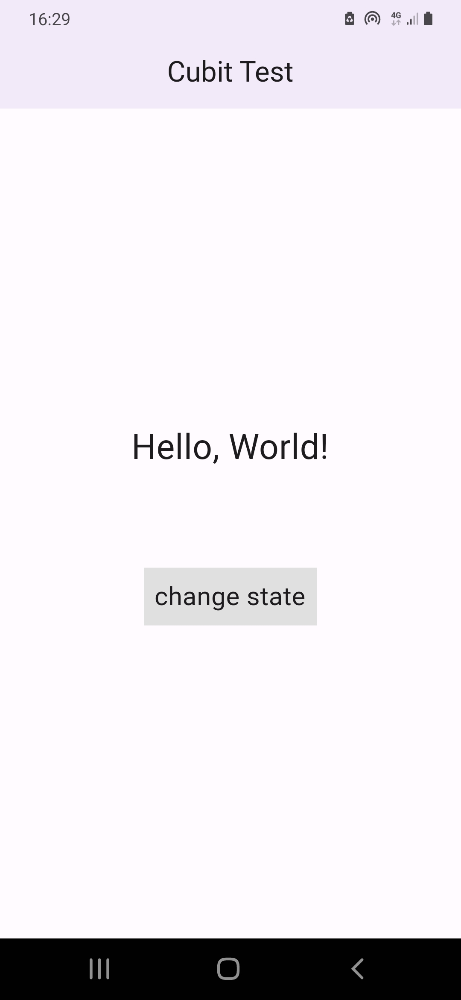
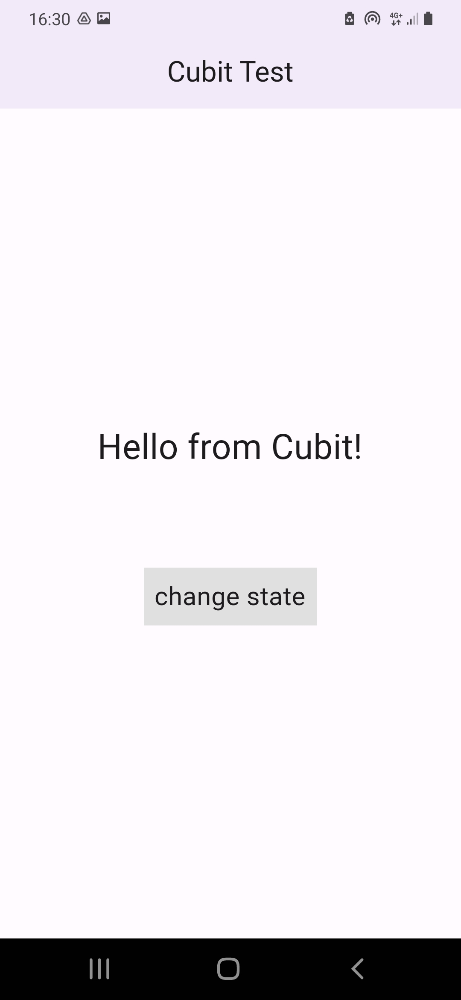

# hello_cubit

## app-about: ❓

    T

## tested-physical-device: 📲

    Samsung Galaxy A40

## main takeaways: 🤓

- [x] Getting familiar with State Managment ( Cubit )
- [x] Create and test simple app

